# XACT Manual

## XACT Manual Table of Contents

- [Introduction](#introduction)
- [Spreadsheet Data Entry](#spreadsheet-data-entry)
  - [Collection Level Data](#collection-level-data)
  - [Component Data](#component-data)
- [Converting XACT Excel Template to EAD-XML](#template-to-ead)
  - [Configure Transformation Scenario](#configure-transformation)
  - [Convert XML to EAD](#xml-to-ead)
  - [Import EAD to ArchivesSpace](#import-ead)
- [Appendix A: Customize note labels in Oxygen](#customize-note-labels)
- [Appendix B: Mapping ContentDM metadata to XACT](#contentdm-to-xact)
- [Appendix C: Reusing metadata from Digital Collections](#reusing-dc-metadata)

## Introduction

Excel to ArchivesSpace Conversion Tool (XACT) makes creating, editing, and uploading collection information  into ArchivesSpace faster and easier. XACT facilitates the creation of both collection (top) level information and inventories. XACT consists of two files: an Excel template and XSL style sheet. To work for ArchivesSpace you will need access to both Excel and oXygen XML Editor. Data is entered in Excel, and oXygen is used for the transformation to EAD-XML.

You begin with the XACT template in Excel. The template can be used for only one collection at a time. The template contains headings which map to fields in ArchivesSpace. XACT contains the minimal fields required for a resource record (finding aid) in ArchivesSpace, in addition to other fields and notes commonly used. It does not contain all possible fields/notes possible in a resource. Though the template may look daunting at first, XACT functions on one basic principle: *hierarchical arrangement*. XACT allows you to input data from the top level of the hierarchy (collection level) all the way down to the lowest level (item level) in order to facilitate nesting in the finding aid. This is accomplished by *mapping* rows and cells to the hierarchical levels above them. So for this to work,  begin with the top level of the collection and work your way down. The collection level will be mapped nested within rather than mapped to? to the series level; the series level will be mapped to the sub-series level; and the sub-series level will be mapped to the file or item level(s). If your collection doesn't have series or sub-series, the concept is still the same: items lower in the hierarchy will be mapped to the level immediately above them (for instance, a collection might not have series, so the file or item level items will be mapped straight to the collection level). By mapping the rows in this way, you tell the computer how to arrange your collection so the relevant sub-series and items will be properly nested in the eventual finding aid . Once you've told the computer how each row relates to the next, you can also input collection and component information such as extents, titles, dates, and notes in their appropriate cells, similar to how you would enter them into the fields of ArchivesSpace. When you’ve finished creating your inventory and adding notes, then you open your spreadsheet in oXygen, which will transform the spreadsheet into EAD-XML using the XACT style sheet. This file can be read by ArchivesSpace, so you will upload the EAD-XML to ArchivesSpace to create and edit the finding aid.

## Spreadsheet Data Entry

From this link, download [the XACT template](xcel2xml.xsl) to the appropriate collection file on the L drive.

> *Please note:* There are three tabs on this spreadsheet. Only add data to the template tab. Delete the introduction and example tabs before opening the spreadsheet in oXygen.

**Tip:** Spellcheck in Excel as you complete the spreadsheet! Spellcheck, at minimum, once a day since the data can quickly become unwieldy. More frequent spell checking is recommended. If your collection data contains many unusual proper nouns add these to the Excel dictionary when the spelling is in recent memory or the box is handy.

**Data entry:** Use the first row to enter collection level information. In these instructions, an asterisk (\*) indicates that a field is required/highly recommended. Below, the underlined data correspond with the names of the fields in the XACT template. The names of the fields are followed by instructions on how to enter data for that field.

**To note:** You cannot repeat any fields in the spreadsheet. For example, if you have cubic and linear feet you can only enter one of them in the spreadsheet. You will have to enter the other after the data is imported to ArchivesSpace.

**DO NOT** change or delete any of the preset fields in row 1 of the template. This will cause the conversion to fail. You can hide fields, change the font size, and/or color code.

**Date formatting:** If you are repurposing dates from a different spreadsheet and have questions about formatting, please see these [instructions](copy-pasting-dates-in-excel.pdf) for copying and pasting dates into Excel without losing formatting.

**Other formatting:** Do not add any formatting such as paragraph breaks or italics in notes. You will have to do this after import.

## Collection Level Data

**Association ID:** Leave blank

**\*Title:** The title of the collection.

    ex. Nye County, Nevada Photograph Collection

**Filing title:** Filing title as you would enter into ArchivesSpace.

    ex. Nye County, Nevada Photograph Collection

    ex. Jackson (Jerry) Papers

**\*Collection level:** Use “collection” without the quotes. Use all lowercase letters.

**Subseries_reference and files_reference:** Leave blank

**\*Unique **Identifier:** Collection number

**\*Extent number:** This is the numerical number associated with linear or cubic footage, or in the case of born-digital collections, the total number of files. Choose your number from linear OR cubic footage OR digital files. This tool can only import one. You’ll enter any remaining extents in ArchivesSpace once the EAD has been uploaded.

**\*Extent type:** Use appropriate term from the following. Be sure to use all lowercase letters. If the term you need isn’t below see the controlled value list in ArchivesSpace for extent_extent_type and select the appropriate machine readable value.

- linear_feet
- cubic_feet
- digital_files

**Extent summary:** This is the container summary.

    ex. 47 hanging folders, 1 shared box of negatives, and 1 CD-ROM

**\*Date expression:** Provide the range of dates for the collection. If you have both inclusive and bulk dates you can only select one type here. This tool can only import one. You’ll enter any remaining date expressions in ArchivesSpace once the EAD has been uploaded.

    ex. 1880-1990

> *Other than use of color, do not use any special formatting in this field. Only “general” formatting is permitted.*

**\*Date type:** Use appropriate term from the following. Be sure to use all lowercase letters.

*   inclusive
*   bulk
*   single

**\*Date begin:** Enter the begin date of your date range from your date expression.

**\*Date end:** Enter the end date of your date range from your date expression.

**Instance type:** Leave blank

**Container type:** Leave blank

**Container indicator:** Leave blank

**Abstract:** Provide the abstract for the collection.

**Bioghist:** Enter the biographical or historical note for the collection. You will need to enter in the appropriate note label after EAD has been imported into ArchivesSpace (Historical Note or Biographical Note) OR customize the EAD-XML in oXygen prior to import into ArchivesSpace (see [Appendix](#customize-note-labels)). Let the person importing know if your note is a Bio or Hist note.

**Processinfo:** Complete with processing note for the collection.

**Relatedmaterial:** Complete with related materials note for the collection.

**Arrangement:** Complete with arrangement note for the collection.

**Acqinfo:** Complete with acquisition note for the collection.

**Prefercite:** Complete with preferred citation note for the collection.

**Scopecontent:** Complete with scope and contents note for the collection.

**generalnote:** Complete when applicable. Generally, we do not use “general note” as a label so you will need to enter in the appropriate note label after EAD has been imported into ArchivesSpace OR customize the EAD-XML in oXygen prior to import into ArchivesSpace (see [Appendix](#customize-note-labels)). If you use general note notify the importer what the label is for your general note. Do not alter the first row of the template in any way.

**accessrestrict:** Complete if note is different from the default access restrictions note. The default note will automatically be applied if this field is left blank.

**userestrict:** Complete if note is different from the default use restrictions note. The default note will automatically be applied if this field is left blank.

## Component Data

**Association id:** This data will not be imported into ArchivesSpace.  This is used only if you have series/subseries or other type of nesting. The association_id will let you associate series with subseries and subseries with other subseries (for nesting) and/or files. You do not need to use this field if you only have files within the collection (no nesting).

See example below. Color coding is not required for import. It is used here to demonstrate how linkages work between the association id, subseries reference, and files reference.

*   You can use any id you want, including words or simple letters/numbers.
*   IDs cannot be repeated in different series, subseries. (i.e subseries A can have file A but subseries B cannot also have file A as an association id)
*   If association id references multiple subseries use commas to separate them.

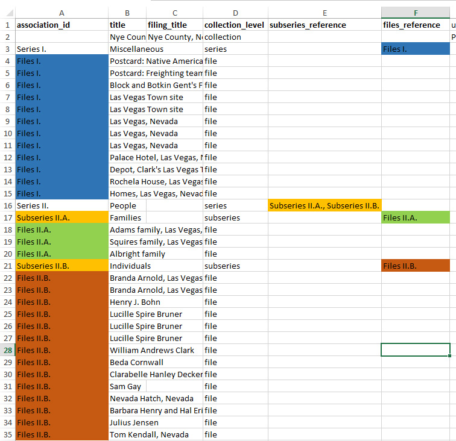

**\*Title:** Title of the series, subseries, file, or item.

**Filing title:** Leave blank.

**\*Collection level:** Use appropriate term from the following. Be sure to use all lowercase letters.
*   series
*   subseries
*   file
*   item

**Subseries_reference:** Use if you have subseries in a series. See screenshot above. Use a comma to separate multiple association ids.

**Files_reference:** Use it for the files within a series or subseries. See screenshot above. You do not need to use this field if you only have files within the collection (no nesting).

**Unique identifier:** This is the Component Unique Identifier. See ArchivesSpace manual for instructions on entering data in this field. For photograph collection this would be the photo id.

**Extent number:** The number for the extent type. To be used with Series and Subseries. Not commonly used with files. If there are multiple extent types you will need to select one to enter here. This tool can only import one. You’ll have to enter any remaining extents for the component in ArchivesSpace once the EAD has been uploaded.

**Extent type:** Use appropriate term from the following. Be sure to use all lowercase letters.
*   linear_feet
*   cubic_feet
*   cassettes
*   files
*   gigabytes
*   leaves
*   photographic_prints
*   photographic_slides
*   reels
*   sheets
*   volumes
*   audio_cassettes
*   betacam
*   betacam_sp_videotapes
*   betamax_videotapes
*   digital_files
*   drawings
*   floppy_disks
*   items
*   photographic_negatives
*   u_matic_videotapes
*   vhs_tapes
*   hanging_folders
*   optical_discs

**Extent summary:** This is the container summary.

**\*Date expression:** Range of dates for the component. If you have both inclusive and bulk dates you will have to select one type to use here. This tool can only import one. You’ll have to enter any remaining extents in ArchivesSpace once the EAD has been uploaded.

> *Other than use of color, do not use any special formatting in this field. Only "general" formatting is permitted.*

**\*Date type:** Use appropriate term from the following.
*   inclusive
*   bulk
*   single

**Date begin:** Complete with begin date of your date range from the date expression.

**Date end:** Complete with end date of your date range from the date expression.

**Instance type:** Select appropriate term from the following. Be sure to use all lowercase letters.
*   mixed_materials
*   graphic_materials
*   audio
*   books
*   computer_disks
*   digital_object
*   digital_object_link
*   maps
*   microform
*   moving_images
*   realia
*   text

**Container type 1:** Choose appropriate term from the following. Be sure to use all lowercase letters.
*   box
*   folder
*   frame
*   object
*   page
*   reel
*   volume
*   album
*   flat_file
*   item
*   oversized_box
*   roll
*   slide_tray
*   digital_file
*   binder
*   sheet

**Container indicator 1:** Complete only if you entered a container type 1. This is the number associated with container type 1.

**Container type 2:** If applicable select from the same terms as container type 1.

**Container indicator 2:** Complete only if you entered a container type 2. This is the number associated with container type 2.

**Container type 3:** If applicable select from the same terms as container type 1.

**Container indicator 3:** Complete only if you entered a container type 3. This is the number associated with container type 3.

**Abstract:** Enter the abstract for the component. See collection level data instructions for further detail.

**Bioghist:** Enter the biographical or historical note for the collection. You will need to enter in the appropriate note label after EAD has been imported into ArchivesSpace (Historical Note or Biographical Note) OR customize the EAD-XML in oXygen prior to import into ArchivesSpace (see [Appendix](#customize-note-labels)).

**Processinfo:** Complete with processing note for the component.

**Relatedmaterial:** Complete with related materials not for the component.

**Arrangement:** Complete with arrangement note for the component.

**Acqinfo:** Complete with acquisition note for the component.

**Prefercite:** Complete with preferred citation note for the component.

**Scopecontent:** Complete with scope and contents note for the component.

**generalnote:** Complete when applicable. Generally, we do not use “general note” as a label so you will need to enter in the appropriate note label after EAD has been imported into ArchivesSpace OR customize the EAD-XML in oXygen prior to import into ArchivesSpace (see [Appendix](#customize-note-labels)). Do not alter the first row of the template in any way.

**accessrestrict:** Complete when applicable.

**userestrict:** Complete when applicable.

## Converting XACT Excel Template to EAD-XML

1.  The current version of oXygen does not import Excel spreadsheets so you will have to modify oXygen’s program files on your computer’s hard drive. You will only have to perform these steps the first time you import an Excel spreadsheet into oXygen. Follow the steps in the tutorial here: [https://www.oXygenxml.com/doc/versions/18.1/ug-editor/topics/import-excel-new-format.html](https://www.oxygenxml.com/doc/versions/18.1/ug-editor/topics/import-excel-new-format.html)

1.  Download [xcel2xml.xsl](xcel2xml.xsl): You should set up a folder to store this file and your eventual EAD-XML transformation in a location you will repeatedly use, such as on your desktop. It is not recommended you save this folder in the collection file on the L drive because you will have to configure the transformation file path setting every time you produce the EAD.
1.  Now you are ready to import the XACT Excel Template for your collection. To import the spreadsheet into oXygen follow these steps:
1.  Open oXygen. Go to File > Import > MS Excel File  
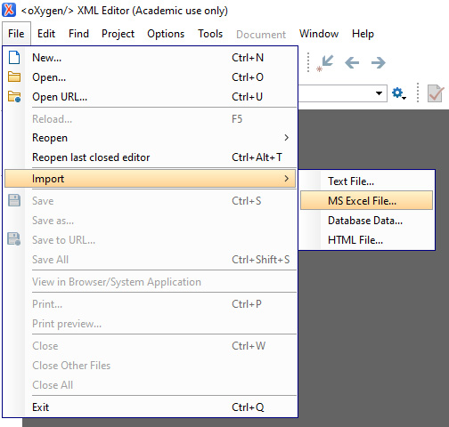
1.  Browse for the file and open. It should look something like this:  
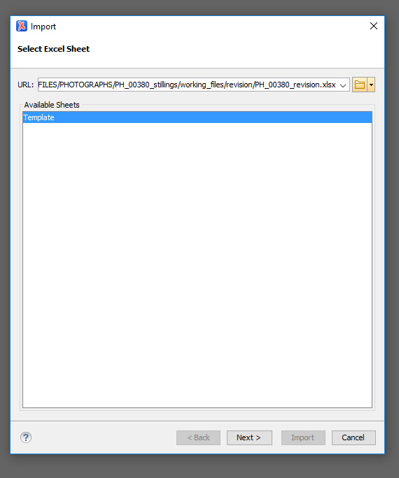
1.  Select Next
1.  Check “First row contains field names” and then click on the blue cog wheel next to the customize button to further change the import settings.  
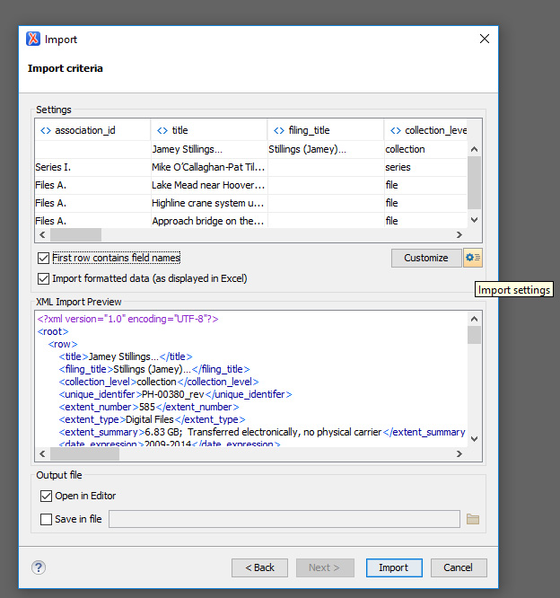
1.  Uncheck the first three boxes. Your screen should look like this:  
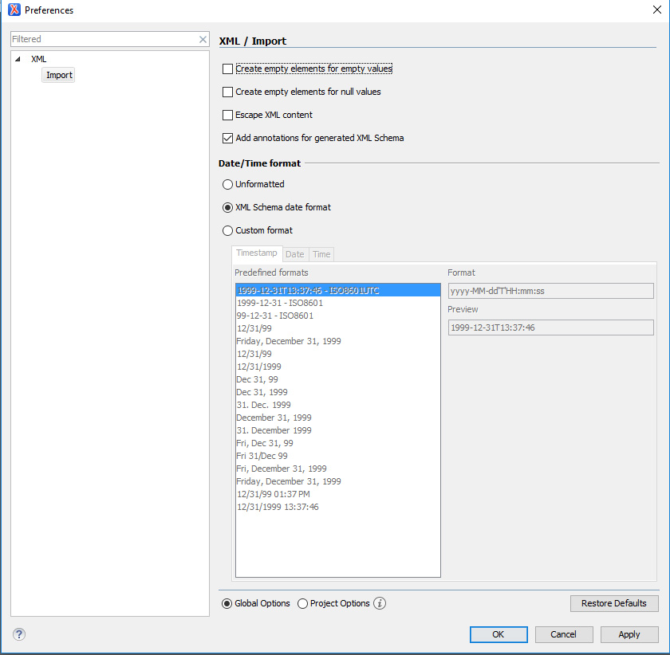
1.  Click Apply
1.  Click OK
1.  Click Import
1.  If the import worked a text box will read “Operation successful.” Close the Import text boxes. You should now be viewing a screen with XML generated from your spreadsheet. Take a look and make sure both the collection level data and container list look complete.
1.  Optional: You can save the file if you want but it is not required.

## Configure Transformation Scenario

It is now time to set up your transformation. Please note, as long as the location of your xcel2xml.xsl file does **not** change you will be able to skip this step the next time you run a transformation.

1.  Open Document > Transformation > Configure Transformation Scenario **OR** select the wrench icon with the red arrow  
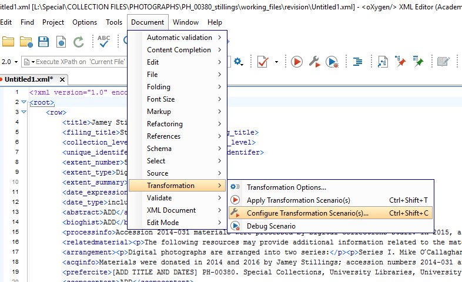  
OR (wrench icon with the red arrow)  
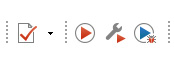  
1.  Select New  
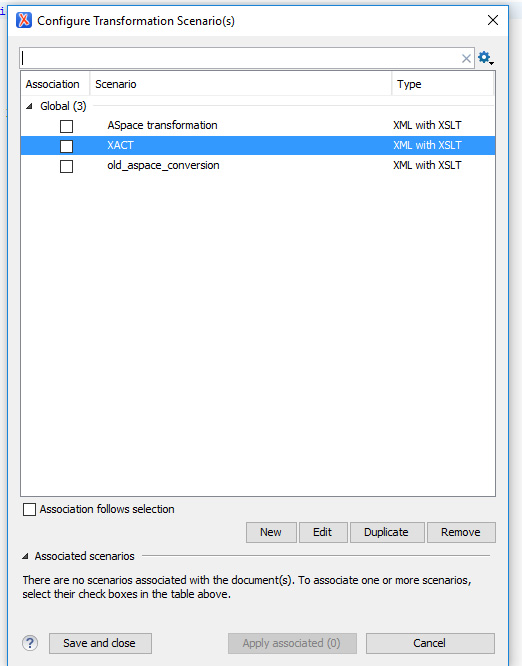  
1.  Select XML transformation with XSLT  
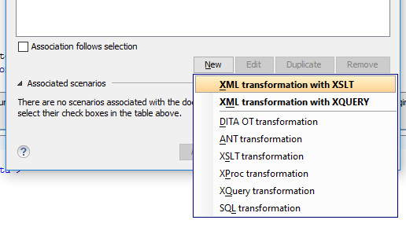  
1.  Under the XSLT tab name the scenario XACT
2.  Select Global Options
3.  XML URL: `${currentFileURL}`
4.  XSL URL: Navigate to the location of your xcel2xml.xsl file and select
5.  Transformer: Saxon-PE 9.6.0.5  
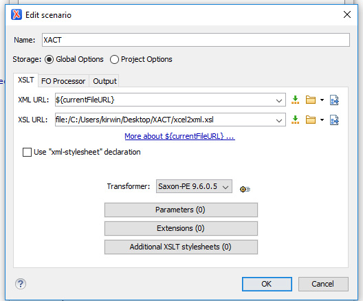  
1.  Now go to the Output tab. Check “Open in Editor” and then select OK.  
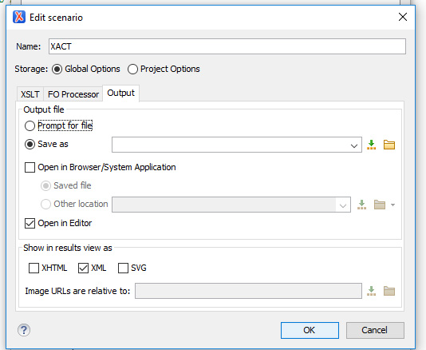
1. Close the dialogue box.  

## Convert XML to EAD

Now you can perform the transformation
1.  Click on the red play button next to the wrench icon  
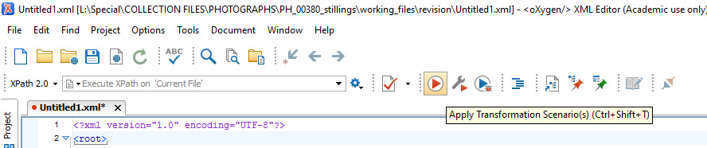
1.  Check the XACT transformation scenario you set up and then select apply associated. (At this stage you may have to make edits to the xml to remove ampersands and other symbols.)  
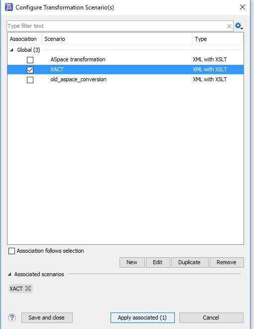
1.  If successful, a new tab will open in oXygen. This is your EAD file.
1.  Take a look and make sure everything looks ok. Are all your components in the EAD? Tip: You can select “Author” (find it at bottom of the EAD next to “Text” and “Grid”) to view the EAD in a human readable format.
1.  If oXygen is pointing out any errors in the XML (red highlights) resolve them before proceeding.
    - Please note: some errors may be due to local rules that do not follow EAD formats such as oversized_box
    - You can also ignore the error if it looks like this: `<c level="file">` OR `<c level="series">` OR `<c level="subseries">`
1.  Save file in the collection file folder on the L drive. This file will be imported into ArchivesSpace in the next step.

## Import EAD to ArchivesSpace

1.  It is always recommended to import the EAD file into a test instance of ArchivesSpace before production to make sure everything looks ok!
1.  Click Create > Background Jobs > import_data  
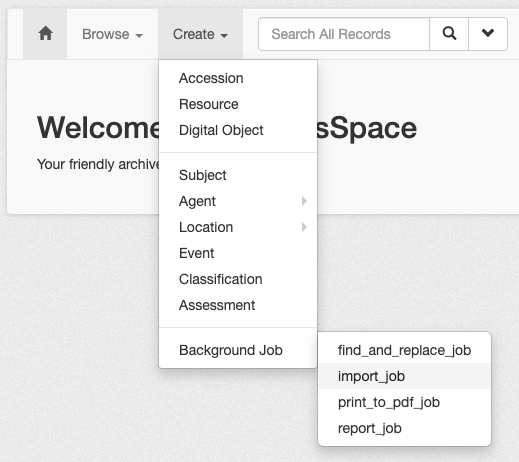
1.  Select EAD for Import Type
1.  Add the EAD file you created. You can add multiple EAD files.  
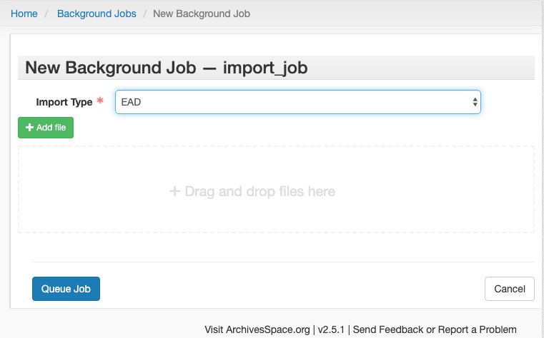
1.  Select Queue Job and wait for import to complete. This step will take several minutes for large collections.
1.  Select Refresh Page. Search for your collection in ArchivesSpace and check to make sure everything looks ok. Is everything properly nested? Are notes complete?
1.  If you uploaded the EAD in ArchivesSpace Test you will need to upload it to actual ArchivesSpace at this point
1.  Change the collection ID. The collection number imported into one box and needs to be parsed out into two per local policy.
1.  If used, you will also need to specify the label(s) for general note(s) and biographical or historical note.
1.  Select "**Publish All**" at the collection level since the import will sometimes mark notes as unpublished (in particular access notes). This action will ensure all notes and fields are published for the public. If you have any notes that should NOT be published you will need to find those notes an uncheck the publish box.

##  Appendix A: Customize note labels in Oxygen

1.  Find your note in the EAD-XML
1.  You can customize your label by changing the information within the `<head>` tag. In the example below we have a general note with the generic “general” label:  

1.  In the screenshot below the label has been changed to "job site"  

##  Appendix B: Mapping ContentDM metadata to XACT

This workflow is typically used for photograph collections that are in ContentDM but do not have a finding aid. Digital Collections will add any export sheets from CDM to the working files folder. 

Note CDM metadata only provides information for the inventory. Continue to use the first line to create collection level information following instructions in the XACT manual.

Look for any missing items. In some cases, some digitization may have be completed previously for a collection supplied in a different sheet  (Digital Collections will not rescan if it is already online). If items are missing, further information from Digital Collections will be necessary.

Mapping from CDM sheet to XACT fields as follows (not all fields are noted – only fields applicable to XACT are included):

|CDM metadata|XACT|Notes|
|--|--|--|
|Object Archival Resource Key (ARK)||Add to column AG for reference purposes only|
|Digital identifier (ex: pho001234)||Add to column AH for reference purposes only (optional)|
|Physical Identifier (0123_0001)|unique_identifier||
|Citation|n/a|Can use to inform collection level XACT data|
|Archival Collection|n/a|Can use to inform collection level XACT data|
|Title|title|Be sure data is being presented consistently (for example if format is included in the title, all components should use it—or not.)|
|Date|date_expression; date_begin; date_end|Use to inform all date fields. Will require some manual editing.|

Other fields may inform finding aid after import (ex: creator, contributor, subjects)

## Appendix C: Reusing metadata from Digital Collections

If a spreadsheet export from Digital Collections has been provided it will be placed in the working files folder for the collection on the L drive. It may be a text (txt) file but you can “open with” excel to easily access the metadata.

For the inventory of the collection map the following DC fields to the following XACT fields:

Title → title

Please note that digital collections formats titles differently. Please evaluate them. We still want the title to be DACS compliant so modify as necessary.

Date → date_expression

Digital Collections does not use YYYY Month DD format so you may have to modify single dates. Be sure to complete date_type, date_being, and date_end as usual.

Digital Identifier →  unique_identifier

Object Archival Resource Key (ARK):

You will need to create a new column. In row 1 column AG. To that cell add: Object Archival Resource Key

You can then add the ARKs in the column. This will facilitate linking directly to the online digital item.

Remember to spell check once you are done!